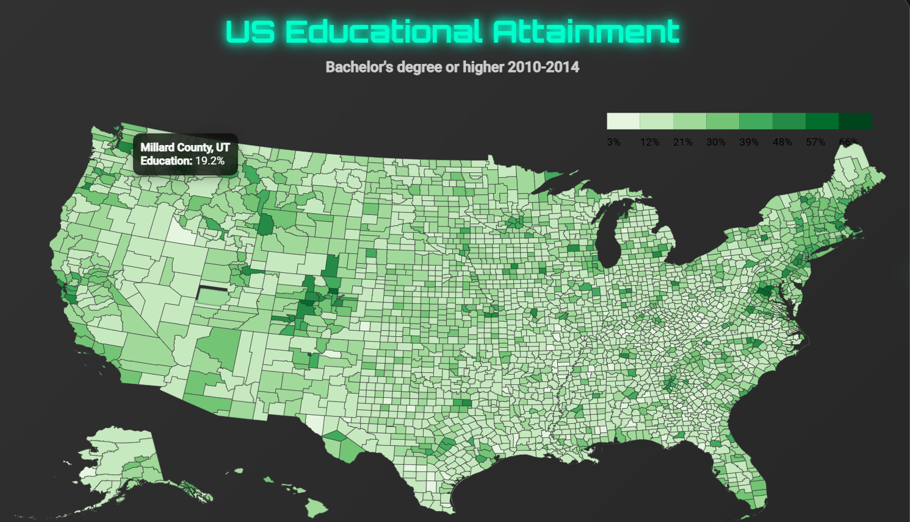

# Choropleth Map Project

## 📌 Overview
This project is a **Choropleth Map** that visualizes the educational attainment across the United States. It displays the percentage of the population aged 25 and older with a bachelor's degree or higher (2010-2014) by county. The map is interactive, allowing users to hover over counties to see detailed information.

The project was developed as part of the [freeCodeCamp Data Visualization Certification](https://www.freecodecamp.org/learn/data-visualization/).

Live Demo [https://eddieborbon.github.io/Choropleth-Map/ ](https://eddieborbon.github.io/Choropleth-Map/ )
 
---

## 🚀 Features
- **Interactive Map**: Hover over any county to see its name, state, and educational attainment percentage.
- **Color Scale**: Uses a quantized color scale to represent different levels of educational attainment.
- **Tooltip**: Displays detailed information in a modern and responsive tooltip.
- **Legend**: Includes a legend to help interpret the color scale.
- **Modern Design**: Features a futuristic and clean design with glassmorphism effects.

---

## 🛠️ Technologies Used
- **HTML5**: Structure of the project.
- **CSS3**: Styling and modern design effects (e.g., glassmorphism).
- **JavaScript**: Logic and interactivity.
- **D3.js**: Data visualization and map rendering.
- **TopoJSON**: Geographic data format for rendering the map.

## 🖥️ How to Use
1. **Clone the Repository**:

   git clone https://github.com/your-username/choropleth-map.git  
   cd choropleth-map  

2. **Open the Project**:  
   Open the `index.html` file in your browser.

3. **Interact with the Map**:  
   Hover over any county to see its name, state, and educational attainment percentage.

---

## 🎨 Design Highlights
- **Glassmorphism**: The container and tooltip use a glass-like effect for a modern look.
- **Neon Colors**: The title and interactive elements use neon colors for a futuristic vibe.
- **Responsive Tooltip**: The tooltip dynamically adjusts its position based on the mouse cursor.

---

## 📊 Data Sources
- **US Education Data**: [for_user_education.json](https://cdn.freecodecamp.org/testable-projects-fcc/data/choropleth_map/for_user_education.json)
- **US County Data**: [counties.json](https://cdn.freecodecamp.org/testable-projects-fcc/data/choropleth_map/counties.json)

---

## 🛠️ Development
### Prerequisites
- A modern web browser (e.g., Chrome, Firefox, Edge).
- Basic knowledge of HTML, CSS, and JavaScript.

### Running Locally
1. Clone the repository.
2. Open `index.html` in your browser.

### Customizing
- To change the color scheme, modify the `legendValues.color` array in `script.js`.
- To update the data, replace the JSON files or modify the `fetch` URLs in `script.js`.

---

## 🤝 Contributing
Contributions are welcome! If you'd like to improve this project, follow these steps:
1. Fork the repository.
2. Create a new branch (`git checkout -b feature/YourFeatureName`).
3. Commit your changes (`git commit -m 'Add some feature'`).
4. Push to the branch (`git push origin feature/YourFeatureName`).
5. Open a Pull Request.

---

## 📜 License
This project is licensed under the MIT License. See the [LICENSE](LICENSE) file for details.

---

## 👨‍💻 Developed by
**Eddie Jonathan García Borbón**  

---

## 🙏 Acknowledgments
- [freeCodeCamp](https://www.freecodecamp.org/) for the project inspiration and dataset.
- [D3.js](https://d3js.org/) for the powerful data visualization library.
- [TopoJSON](https://github.com/topojson/topojson) for the geographic data format.

---

¡Gracias por revisar este proyecto! 🚀
